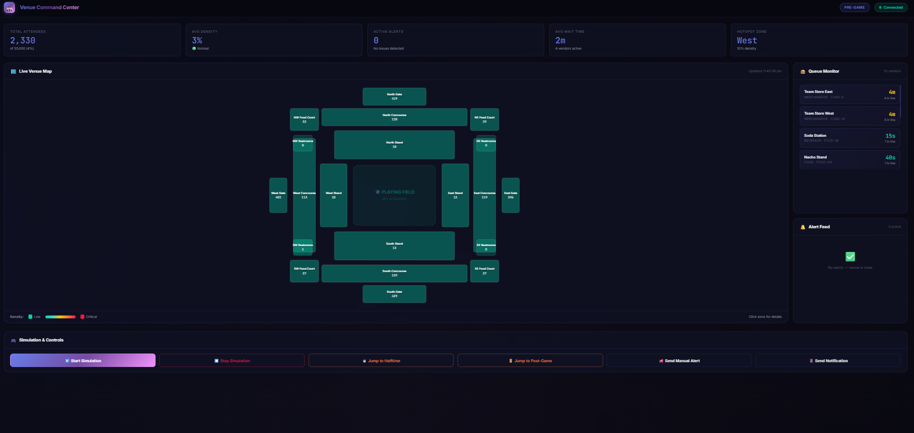
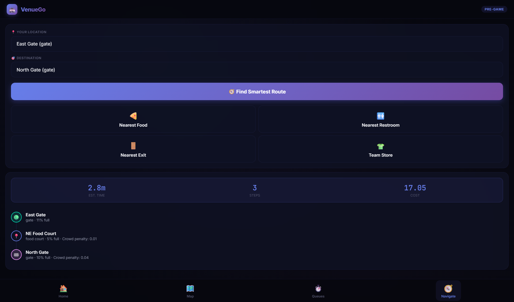
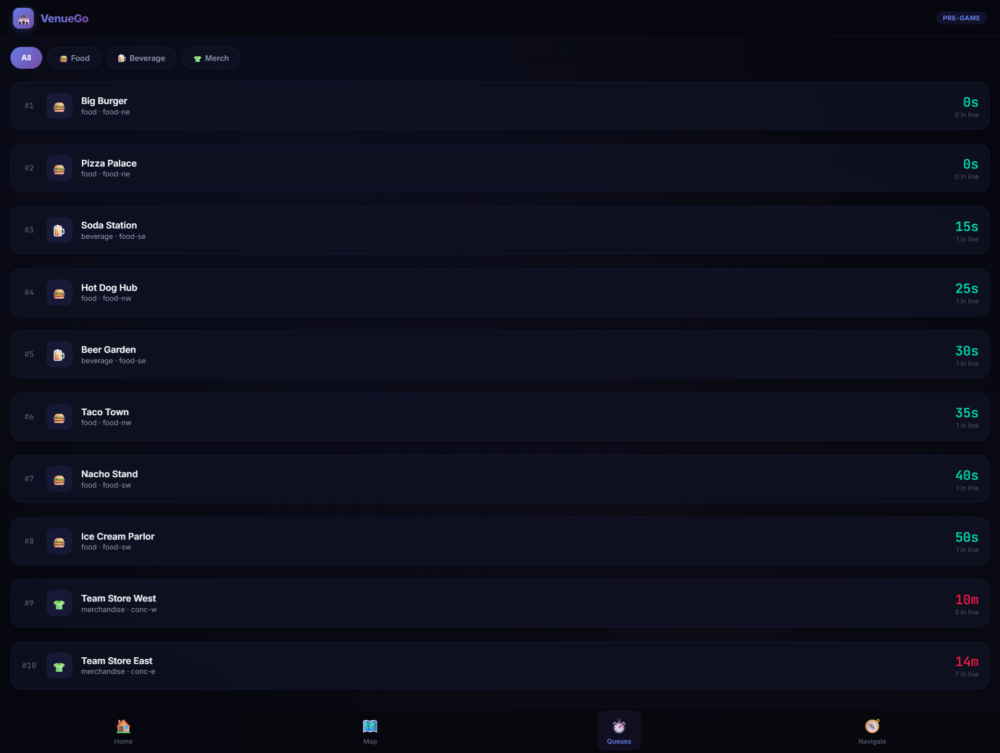
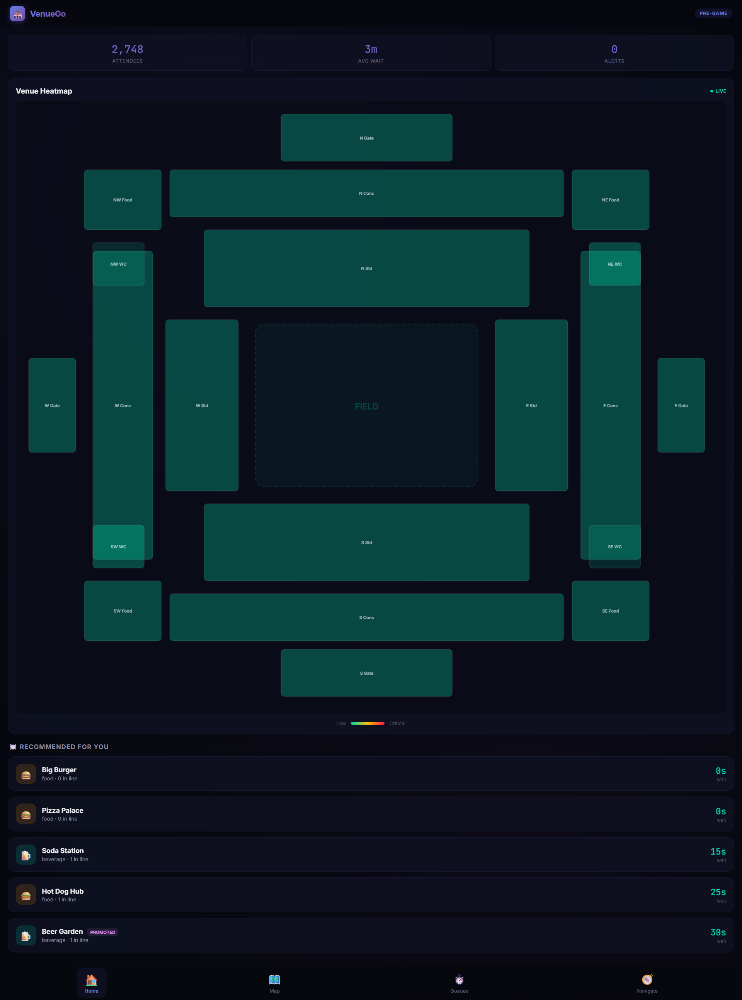

# 🏟️ Intelligent Venue Experience Platform

> This system acts as a real-time assistant for attendees, helping them make optimal decisions inside the venue.


A multi-tenant SaaS platform that reduces congestion, minimizes wait times, provides smart navigation, and enables real-time coordination for venue operators.

Uses Google Maps Platform (conceptually / extendable) for venue mapping and routing integration.
---

## 🚀 Quick Start

```bash

# 1. Install dependencies
cd backend
npm install

# 2. Start the server
npm start

# 3. Open in browser
# Operator Dashboard:  http://localhost:3000/dashboard
# Attendee Mobile App: http://localhost:3000/mobile
# API Root:            http://localhost:3000/
```

**That's it!** No Docker, no database, no external services needed. Everything runs in-memory.

---

## 📱 Usage

### 1. Start Simulation
Click **"▶️ Start Simulation"** on the dashboard or call:
```bash
curl -X POST http://localhost:3000/api/simulation/start
```

### 2. Watch Real-Time Updates
- **Dashboard**: See the venue heatmap update live, queues fill up, and alerts fire
- **Mobile App**: See crowd density, browse queue times, and get smart navigation

### 3. Control the Simulation
- **Jump to Halftime**: See the halftime rush at food courts
- **Jump to Post-Game**: See the exit congestion at gates
- **Send Manual Alerts**: Use operator controls to push notifications

### 4. Smart Navigation
On the mobile app:
1. Go to **Navigate** tab
2. Select your current zone and destination
3. Click **"Find Smartest Route"** — uses Dijkstra's algorithm with crowd-penalty-weighted edges
4. Or use quick buttons: **Nearest Food**, **Nearest Restroom**, **Nearest Exit**

---

## 🏗️ Architecture

```
┌─────────────────────────────────────────────────────────┐
│                  Express + Socket.io Server              │
├──────────┬──────────┬───────────┬───────────┬──────────┤
│  Crowd   │  Queue   │  Routing  │ Decision  │  Simul-  │
│  Engine  │  Engine  │  Engine   │  Engine   │  ation   │
│ (density)│(predict) │(Dijkstra) │ (rules)   │ (mock)   │
├──────────┴──────────┴───────────┴───────────┴──────────┤
│              In-Memory Store (Redis-compatible)          │
└─────────────────────────────────────────────────────────┘
       ↕ REST API + WebSocket (real-time broadcast)
┌────────────────┐         ┌────────────────────┐
│  Dashboard     │         │  Mobile PWA        │
│  (Operator)    │         │  (Attendee)        │
└────────────────┘         └────────────────────┘
```

---

## 🧠 Core Algorithms

### Crowd Density Engine
- Aggregates users into zones
- Computes `density = currentCount / capacity`
- Detects anomalies using 2σ statistical thresholds

### Queue Prediction Engine
- `wait_time = queue_length × avg_service_time`
- Exponential smoothing: `predicted = α × current + (1-α) × historical`
- Vendor ranking: `score = waitScore + bidScore` (monetization)

### Smart Routing (Dijkstra)
- Venue represented as weighted graph (20 zones, ~80 edges)
- Edge weight = `distance + crowd_penalty(density)`
- `crowd_penalty = 50 × density³` (exponential avoidance of congested zones)
- `findNearest(zone, type)` — finds optimal path to closest facility of type

### Decision Engine (Rule-Based)
| Rule | Trigger | Action |
|------|---------|--------|
| Congestion Warning | zone density > 80% | Alert operators |
| Critical Congestion | zone density > 95% | Alert operators + notify attendees |
| Anomaly Detection | density change > 2σ | Alert operators |
| Queue Spike | queue growth > 2x | Alert operators |
| Promotion | low wait + high bid vendor | Notify nearby attendees |
| Rerouting | gate > 70% + another < 40% | Suggest alternative gate |

---

## 📊 Simulation Phases

| Phase | Duration | Behavior |
|-------|----------|----------|
| Pre-Game | 3 min | People enter gates → concourses → seating |
| First Half | 4 min | Most seated, light food/restroom traffic |
| Halftime | 2 min | Mass movement to food courts & restrooms |
| Second Half | 4 min | Return to seats |
| Post-Game | 3 min | Everyone exits through gates |

---

## 🌐 API Reference

| Method | Endpoint | Description |
|--------|----------|-------------|
| GET | `/api/venue` | Venue metadata |
| GET | `/api/zones` | All zones with live density |
| GET | `/api/vendors` | All vendors with queue data |
| GET | `/api/vendors/recommendations` | Ranked vendor list |
| POST | `/api/route` | Smart routing (Dijkstra) |
| GET | `/api/nearest?from=X&type=Y` | Find nearest facility |
| GET | `/api/alerts` | Active alerts |
| POST | `/api/alerts` | Create manual alert |
| POST | `/api/notifications` | Send push notification |
| POST | `/api/simulation/start` | Start simulation |
| POST | `/api/simulation/stop` | Stop simulation |
| POST | `/api/simulation/phase` | Jump to phase |
| GET | `/api/state` | Full state dump |

---

## 📂 Project Structure

```
PromptWar/
├── backend/
│   ├── server.js            # Express + Socket.io API server
│   ├── store.js             # In-memory data store
│   ├── data/
│   │   └── venue-seed.js    # Venue layout (20 zones, 10 vendors)
│   └── engines/
│       ├── crowd.js         # Crowd Intelligence Engine
│       ├── queue.js         # Queue Prediction Engine
│       ├── routing.js       # Dijkstra Smart Routing
│       ├── decision.js      # Rule-Based Decision Engine
│       └── simulation.js    # Event Simulation Engine
├── dashboard/
│   └── index.html           # Operator Dashboard (dark theme)
├── mobile/
│   ├── index.html           # Attendee PWA (mobile-optimized)
│   └── manifest.json        # PWA manifest
├── docker-compose.yml       # Production deployment reference
├── package.json
└── README.md
```

---

## 🔮 Production Upgrade Path

| Component | MVP | Production |
|-----------|-----|-----------|
| Database | In-memory | PostgreSQL + Redis |
| Streaming | Internal events | Apache Kafka |
| Mobile | PWA (HTML) | React Native |
| Dashboard | Static HTML | Next.js |
| Maps | SVG-based | Mapbox GL JS |
| Auth | None | JWT + OAuth2 |
| Deployment | `node server.js` | Docker + Kubernetes |
| Scale | Single process | Horizontal (load balanced) |

---

## 📄 License

MIT


## 🎯 Challenge Vertical
Smart Venue Experience / Crowd Management

## 🧠 Approach

The system is designed as a real-time decision intelligence platform that processes live venue data and provides actionable insights to users.

Key components:

- **Crowd Engine**: Aggregates users into zones and calculates real-time density
- **Queue Engine**: Estimates wait times using queue length and service rate with smoothing
- **Routing Engine**: Uses Dijkstra’s algorithm with crowd-aware weights to find optimal paths
- **Decision Engine**: Applies rule-based logic to trigger alerts, rerouting, and recommendations

All components work together in an event-driven architecture to continuously update the system state and respond to changing conditions.

## ⚙️ How It Works

1. **Simulation Engine** generates realistic crowd movement and queue data (since no IoT is used in MVP)

2. **Data Processing**
   - Crowd Engine updates zone densities
   - Queue Engine calculates wait times
   - Routing Engine computes optimal paths

3. **Decision Engine**
   - Detects congestion and anomalies
   - Generates alerts and recommendations
   - Suggests better routes and vendor choices

4. **Real-Time Updates**
   - Data is pushed to the dashboard and mobile app via WebSockets
   - Users receive live updates, alerts, and navigation suggestions

5. **User Interaction**
   - Attendees view heatmaps, queues, and routes
   - Operators monitor and control venue flow

## 📌 Assumptions

- No physical IoT devices are used; crowd data is simulated for MVP
- User location is mapped to predefined zones instead of precise GPS tracking
- Queue data is estimated using user activity and statistical models
- Venue layout is modeled as a graph for routing
- System is designed to be extensible with real sensors and Google Maps integration

## 📸 Screenshots

### 🎛️ Operator Dashboard


### 📱 Mobile App - Navigation


### 📊 Queue Monitoring


### 🗺️ Heatmap View


## 🌐 Live Demo

- Operator Dashboard: https://your-app.onrender.com/dashboard  
- Attendee Mobile App: https://your-app.onrender.com/mobile  